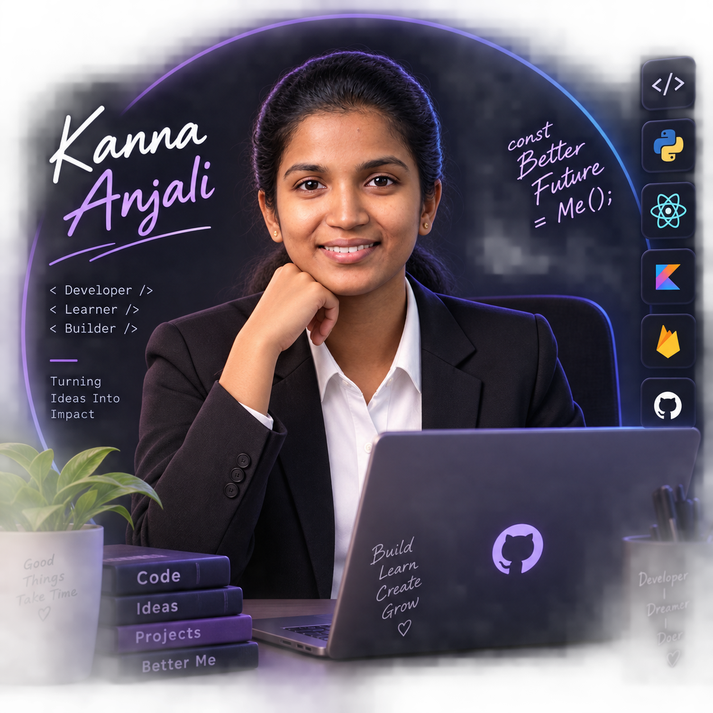
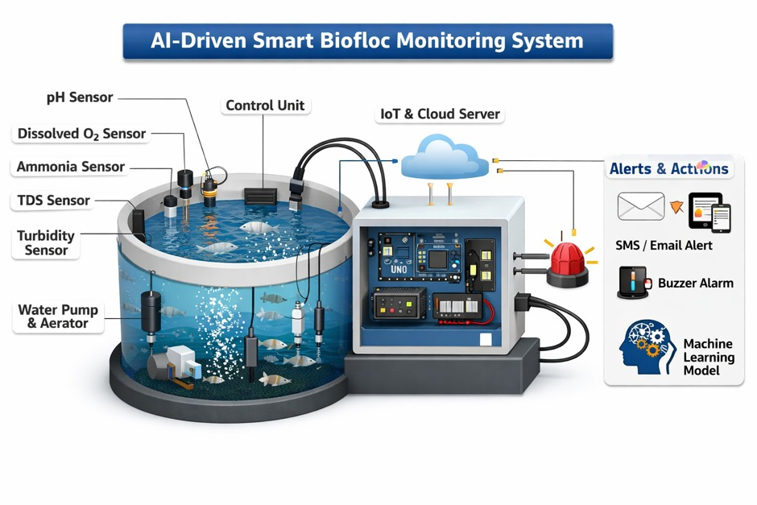
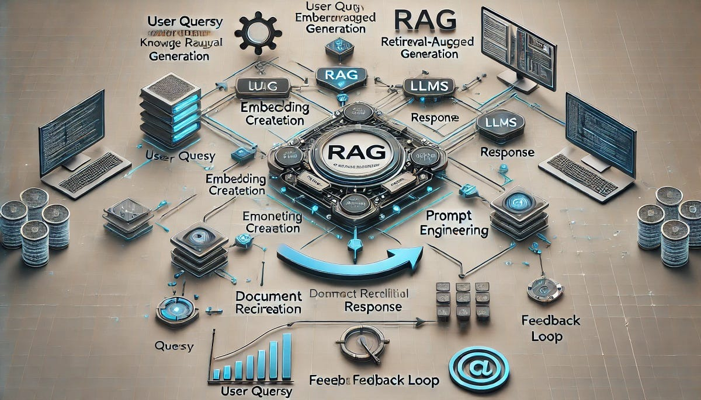
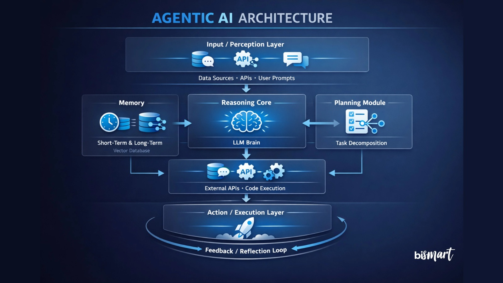
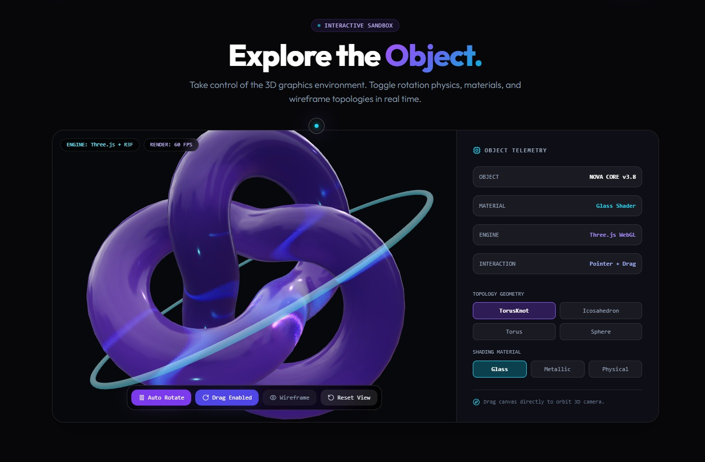
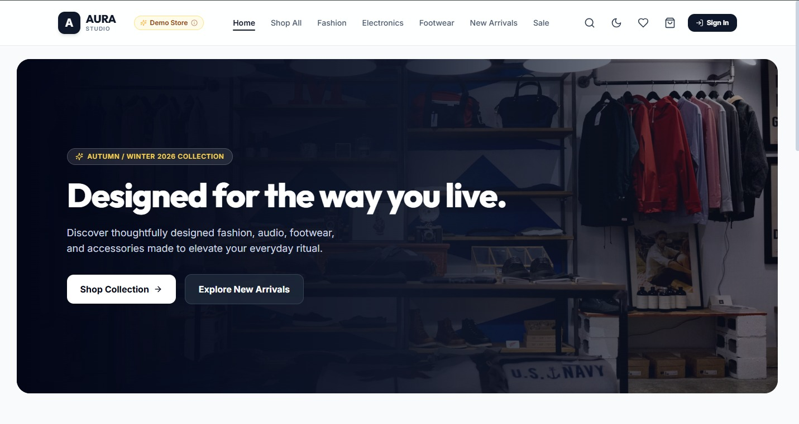
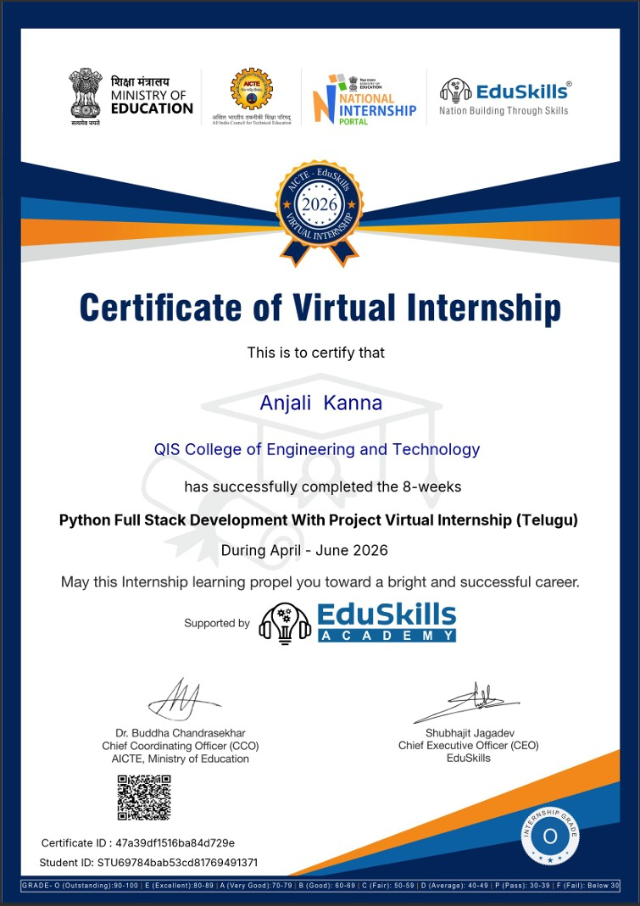
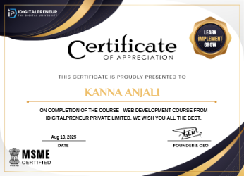
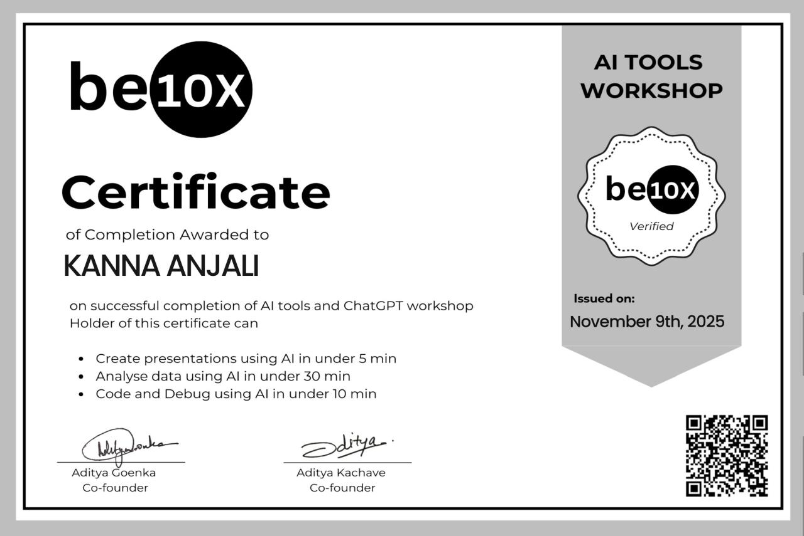

<div align="center">


<br>

[](https://git.io/typing-svg)

<br>

<a href="https://anjalikanna1470.github.io/Personal_Portfolio_Website/">

</a>

<a href="https://linkedin.com/in/anjalikanna1470">

</a>

<a href="mailto:anjalikanna1470@gmail.com">

</a>

<a href="https://github.com/anjalikanna1470">

</a>

<br><br>


</div>

---

# 🧑‍💻 About Me

<div align="center">

<table>
<tr>

<td width="40%" align="center">



<br><br>

### ✨ KANNA ANJALI

`Computer Science Engineer`

`AI • Web • Android • Agentic AI`

<br>


</td>

<td width="60%">

### Hello! I'm Anjali 👋

I'm a **3rd-year B.Tech Computer Science & Engineering student** at **QIS College of Engineering & Technology, Ongole**.

I enjoy building **real-world software applications** by combining modern web technologies, Android development, backend systems and Artificial Intelligence.

My current focus is to explore **Agentic AI deeply**, including:

* 🤖 Large Language Models
* 🧠 AI Agents
* 🔎 Retrieval-Augmented Generation (RAG)
* 🧩 Tool Calling & AI APIs
* ⚡ AI Automation
* 📚 Embeddings & Semantic Search
* 🔗 Intelligent Workflows

I learn technology primarily by **building projects and experimenting with practical implementations**.

### 💭 My Direction

```text
Software Development
        ↓
AI Applications
        ↓
Generative AI
        ↓
RAG + LLM Concepts
        ↓
AI Agents
        ↓
Agentic AI
        ↓
Intelligent Applications 🚀
```

</td>

</tr>
</table>

</div>

---

# 🌌 My Developer Universe

<div align="center">

<table>
<tr>

<td align="center" width="20%">

### 🌐

### WEB

React.js
TypeScript
JavaScript
Tailwind
Vite

</td>

<td align="center" width="20%">

### 📱

### MOBILE

Kotlin
Android
Flutter
Firebase
XML

</td>

<td align="center" width="20%">

### 🤖

### AI

Python
ML
Computer Vision
LLMs
RAG

</td>

<td align="center" width="20%">

### ⚡

### AGENTIC

AI Agents
AI APIs
n8n
Automation
Tools

</td>

<td align="center" width="20%">

### 🔧

### ENGINEERING

DSA
OOP
DBMS
Git
Backend

</td>

</tr>
</table>

</div>

---

# 📊 My Skill Landscape

<div align="center">

| 🧩 Development Area        |  🌱 Current Focus  |
| :------------------------- | :----------------: |
| 🌐 Web Development         | 🟪🟪🟪🟪🟪🟪🟪🟪⬜⬜ |
| 📱 Android Development     |  🟦🟦🟦🟦🟦🟦🟦⬜⬜⬜ |
| 🤖 Artificial Intelligence |  🟣🟣🟣🟣🟣🟣🟣⬜⬜⬜ |
| 🧠 Machine Learning        |  🟠🟠🟠🟠🟠🟠⬜⬜⬜⬜  |
| 🔎 RAG & Semantic Search   |  🔵🔵🔵🔵🔵🔵⬜⬜⬜⬜  |
| ⚡ Agentic AI               |  🟢🟢🟢🟢🟢🟢⬜⬜⬜⬜  |
| 🔧 Backend & APIs          |  🟡🟡🟡🟡🟡🟡⬜⬜⬜⬜  |
| 📐 DSA & CS Fundamentals   |  🔴🔴🔴🔴🔴🔴⬜⬜⬜⬜  |

</div>

> These represent areas I am actively learning and building with — not formal proficiency ratings.

---

# 🚀 Featured Projects

## 🚁 AI Drone — Real-Time Forest Fire Detection

<div align="center">


</div>

### 🌲 AI-powered forest fire & smoke detection system

A drone-based computer vision project focused on detecting **forest fires and smoke in real time** using YOLO11.

**Core Stack**

`Python` `YOLO11` `OpenCV` `Raspberry Pi` `GPS` `Firebase` `FastAPI` `Kotlin`

### 🔥 Key Highlights

* 🔥 Real-time fire & smoke detection
* 👁️ YOLO11 computer vision model
* 🍓 Raspberry Pi processing
* 📍 GPS-based location information
* ☁️ Firebase cloud integration
* ⚙️ FastAPI backend
* 📱 Android monitoring application

**Status:** 🚧 Currently in Development

---

# 🐟 Smart Biofloc Monitoring System

<div align="center">



</div>

### 🌱 IoT + Machine Learning based monitoring system

A smart system designed to monitor important water and environmental parameters in a biofloc fish farming environment.

### 📡 What it monitors

* 🧪 pH
* 💧 TDS
* 🌊 Turbidity
* 🌡️ Temperature
* 🌫️ Gas / air parameters
* 📊 Historical readings

### ⚙️ System

```text
Arduino Uno
     ↓
  ESP8266
     ↓
  Firebase
     ↓
 Android App
```

### 🧠 Intelligence

The system also explores **Machine Learning-based condition prediction** and abnormal-value alerts.

[](https://anjalikanna1470.github.io/Biofloc-IoT-System/)

---

# 📚 Document Retrieval AI

<div align="center">



</div>

### 🔎 Mobile AI document assistant

A document assistant that allows users to upload PDFs, retrieve relevant information using semantic search and generate AI-powered responses.

**Technologies**

`Kotlin` `Android` `Flask` `FAISS` `Sentence Transformers` `Embeddings` `Groq`

### ✨ Features

* 📄 PDF upload
* 🔤 Text extraction
* ✂️ Document chunking
* 🧠 Embeddings
* 🔎 Semantic retrieval
* 📚 FAISS vector search
* 🤖 AI-generated answers

---

# 🤖 Agentic AI — My Current Direction

<div align="center">



</div>

I'm currently **learning Agentic AI deeply** and exploring how modern AI systems can move beyond simple question-answering applications.

### 🧠 Areas I'm Exploring

```text
LLMs
 │
 ├── Prompt Engineering
 │
 ├── RAG
 │
 ├── Embeddings
 │
 ├── Vector Search
 │
 ├── AI Agents
 │
 ├── Tool Calling
 │
 ├── AI APIs
 │
 └── Automation
        ↓
    Agentic AI
```

My goal is to understand how these concepts can be combined to build **useful, intelligent and autonomous applications**.

---

# 🌈 Web Project Collection

<div align="center">

## 🌌 NOVA 3D



### Interactive 3D Web Experience

`React.js` `Three.js` `React Three Fiber` `Drei` `Framer Motion`

[](https://github.com/anjalikanna1470)

---

## 🛍️ AURA Studio



### Modern E-Commerce Product Gallery

`React` `Vite` `React Router` `Tailwind` `Framer Motion`

[](https://github.com/anjalikanna1470)

---

## 🩸 Blood Bridge

### Blood Donation & Connection Platform

`HTML` `CSS` `JavaScript` `Responsive Design`

[](https://anjalikanna1470.github.io/Blood-Bridge/)

---

## 🎓 College Website

### Responsive College Website

`HTML` `CSS` `JavaScript` `Bootstrap`

[](https://anjalikanna1470.github.io/College-Website/)

</div>

---

# 🧰 Technology Stack

<div align="center">

### 💻 Languages


<br><br>

### 🌐 Frontend


<br><br>

### 📱 Mobile


<br><br>

### ⚙️ Backend & Development


<br><br>

### 🤖 AI / Intelligent Systems


<br><br>

### 🔧 Tools


</div>

---

# 📈 My Development Journey

<div align="center">

```text
╭────────────────────────────────────────────────────╮
│             🚀 DEVELOPMENT JOURNEY                 │
╰────────────────────────────────────────────────────╯

       🌐 WEB DEVELOPMENT
                │
                ▼
       ⚛️ REACT + TYPESCRIPT
                │
                ▼
       📱 ANDROID + KOTLIN
                │
                ▼
       🐍 PYTHON + BACKEND
                │
                ▼
       🧠 MACHINE LEARNING
                │
                ▼
       👁️ COMPUTER VISION
                │
                ▼
       🔎 RAG + SEMANTIC SEARCH
                │
                ▼
       💬 LLM CONCEPTS
                │
                ▼
       ⚡ AI APIs + AUTOMATION
                │
                ▼
       🤖 AGENTIC AI
                │
                ▼
       🚀 INTELLIGENT APPLICATIONS
```

</div>

---

# 📅 Development Timeline

<div align="center">

|  📅 Period  | 🧭 Focus                              |
| :---------: | :------------------------------------ |
|   **2024**  | 🌐 Web Development                    |
|   **2025**  | 📱 Android · Kotlin · Firebase        |
| **2025–26** | 🐍 Python · Backend · APIs            |
|   **2026**  | 🧠 Machine Learning · Computer Vision |
|   **2026**  | 🔎 RAG · Embeddings · Semantic Search |
|   **2026**  | ⚡ AI APIs · n8n · Automation          |
|   **NOW**   | 🤖 Deeply Exploring Agentic AI        |

</div>

---

# 🧠 Agentic AI Learning Focus

<div align="center">

| 🧩 Concept       |  🔥 Learning Focus |
| :--------------- | :----------------: |
| 🧠 LLM Concepts  | 🟦🟦🟦🟦🟦🟦🟦🟦⬜⬜ |
| 🔎 RAG           |  🟪🟪🟪🟪🟪🟪🟪⬜⬜⬜ |
| 📚 Embeddings    |  🟣🟣🟣🟣🟣🟣🟣⬜⬜⬜ |
| 🤖 AI Agents     |  🟢🟢🟢🟢🟢🟢⬜⬜⬜⬜  |
| 🛠️ Tool Calling |  🟠🟠🟠🟠🟠🟠⬜⬜⬜⬜  |
| ⚡ AI Automation  |  🔵🔵🔵🔵🔵🔵🟢⬜⬜⬜ |
| 🔗 n8n Workflows |  🟡🟡🟡🟡🟡🟡⬜⬜⬜⬜  |

</div>

---

# 🎓 Certifications

<div align="center">

<table>
<tr>

<td align="center">

<a href="./assets/certificates/eduskills-python-full-stack.png">



</a>

<br>

### Python Full Stack Development

**EduSkills**

</td>

<td align="center">

<a href="./assets/certificates/hackerrank-css-basic.png">


</a>

<br>

### CSS Basic

**HackerRank**

</td>

</tr>

<tr>

<td align="center">

<a href="./assets/certificates/idigitalpreneur-web-development.png">



</a>

<br>

### Web Development

**iDigitalPreneur**

</td>

<td align="center">

<a href="./assets/certificates/be10x-ai-tools.png">



</a>

<br>

### AI Tools & ChatGPT Workshop

**be10X**

</td>

</tr>
</table>

<br>

**🔗 Click a certificate to view it**

</div>

---

# 🏆 GitHub Achievements

<div align="center">

[](https://github.com/ryo-ma/github-profile-trophy)

</div>

---

# 📊 GitHub Statistics

<div align="center">


</div>

---

# 🔥 Coding Consistency

<div align="center">


</div>

---

# 🟩 GitHub Contribution Calendar

<div align="center">

<table>
<tr>
<td align="center" bgcolor="#0d1117">

<br>

### `MY CODING ACTIVITY`


<br><br>


<br><br>

</td>
</tr>
</table>

</div>

### 🟩 What the calendar shows

* 📅 **When I contributed to GitHub**
* 💻 **Daily coding activity**
* 🟢 **Contribution intensity**
* 🔥 **Consistent development periods**

---

# 🎯 Currently Learning

<div align="center">


</div>

---

# 💡 My Development Philosophy

<div align="center">

```text
          💡 IDEA
             ↓
        🔍 UNDERSTAND
             ↓
        🏗️ DESIGN
             ↓
         💻 BUILD
             ↓
         🧪 TEST
             ↓
         🚀 DEPLOY
             ↓
        📈 IMPROVE
             ↓
        🔁 REPEAT
```

### **Learn → Build → Experiment → Improve → Repeat**

</div>

---

# 🌟 Beyond Code

<div align="center">

<table>
<tr>

<td align="center">

### 💡

**Curious**

Always exploring new technologies.

</td>

<td align="center">

### 🛠️

**Builder**

Learning through real projects.

</td>

<td align="center">

### 🧠

**Learner**

Continuously improving my skills.

</td>

<td align="center">

### 🚀

**Dreamer**

Building towards bigger ideas.

</td>

</tr>
</table>

<br>

> **"Turning ideas into intelligent applications, one project at a time."**

</div>

---

# 🤝 Let's Connect

<div align="center">

<a href="https://github.com/anjalikanna1470">


</a>

<a href="https://linkedin.com/in/anjalikanna1470">


</a>

<a href="mailto:anjalikanna1470@gmail.com">


</a>

<br><br>

<a href="https://anjalikanna1470.github.io/Personal_Portfolio_Website/">


</a>

</div>

---

<div align="center">

### `BUILD • LEARN • EXPERIMENT • INNOVATE`

**🌌 Exploring AI. Building Systems. Creating the Future.**

<br>

⭐ **Open to collaboration, learning and innovative projects** ⭐

<br><br>


</div>
